# 简介
> 本项目为上个版本 [noteblogv5](https://github.com/miyakowork/noteblogv5) 升级&重构而来，经过代码重构一些处理逻辑和主题包升级等。<br/>

> NotePress是一款基于layui的响应式的个人/博客建站系统，简洁美观功能强大

> 开源版本请前往 [noteblogv5(github)](https://github.com/miyakowork/noteblogv5) 或 [noteblogv5(gitee)](https://gitee.com/wuwenbn/noteblogv5)(最新版本v5.9)

+ 后台管理采用前后端分离方式，jwt+mongo模式鉴权，独立于前台，更安全。
+ 后端主要采用springboot、mybatis-plus。
+ 采用springboot、mybatis-plus、layui等多种流行框架。
+ 移动端适应良好，自带富文本编辑器和markdown编辑器两种类型，自由选择。
+ 网站风格设置多种（共5种风格设置），支持github、qq登录等第三方登录方式。
+ 网站包含丰富的个性化设置，包含开关类型、文本类型等设置（详情见下方预览图）。
+ 默认主题包含5种内容风格设置、2种笔记风格设置，且遵循响应式，多平台多分辨率都适配。
+ 支持主题定制功能，能够自由的更换网站的风格。
+ 更多详情请关注网站作者网站：<<[NotePress](https://wuwenbin.me)>> 。

> 点击链接加入群聊，获取前端工程&文档查看（付费）【[NotePress ~ 交流反馈：697053454](https://jq.qq.com/?_wv=1027&k=5ZEGGl8)】<br/>

# 当前版本 
```shell
v2020.004_0524 (2020年5月24日)
```

## 更新日志 
---
**此次更新需要更执行以下sql脚本，请注意！**
```sql
INSERT INTO `notepress`.`np_param` (`name`, `value`, `group`, `remark`, `order_index`, `gmt_create`, `gmt_update`, `create_by`, `update_by`) VALUES ('recharge_server_domain', '', '1', '充值服务的域名/ip地址', '0', now(), NULL, NULL, NULL);
INSERT INTO `notepress`.`np_param` (`name`, `value`, `group`, `remark`, `order_index`, `gmt_create`, `gmt_update`, `create_by`, `update_by`) VALUES ('switch_recharge_server', '0', '2', '是否开启自动充值服务', '0', NULL, NULL, NULL, NULL);
INSERT INTO `notepress`.`np_param` (`name`, `value`, `group`, `remark`, `order_index`, `gmt_create`, `gmt_update`, `create_by`, `update_by`) VALUES ('recharge_sign_secretKey', '', '-1', '\r\n校对密钥，需要和充值微服务端那边设置的一样，没有请忽略', '0', NULL, NULL, NULL, NULL);

ALTER TABLE `np_res` ADD COLUMN `res_intro_url` text  DEFAULT NULL COMMENT  '' AFTER `res_url`;
ALTER TABLE `np_res` ADD COLUMN `auth_code` varchar(50)  DEFAULT  '' COMMENT  '' AFTER `res_intro_url`;
```

>2020年4月18日 (插件服务，v2020.003_0418)
+ 增加对接扫码支付的功能（无需签约，支持支付宝和微信，需要安装服务jar包和apk，单独购买）
 + 新增自动充值和手动确认充值的切换（配合上面的功能服务）
>2020年4月18日 (主程序，v2020.003_0418)
+ 资源页面优化，新增支持第三方网盘分享（含授权码功能）
+ 新增资源简介页面跳转的功能
+ 笔记页面优化，现在笔记中的图片可以跳转查看大图啦
+ 修复笔记页面不能切换回第一条的问题
+ 修复几处主题页面文本显示错误的问题
+ 优化添加内容时的操作体验和修复一些已知的问题
+ 优化用户注册时候绑定第三方账号的体验
+ 调整欢迎页的卡片宽度（现在不会显示那么的宽了）
+ 现在用户中心用户可以自定义更换头像了

>2020年4月2日 (v2020.002)
+ 多处用户体验优化
> 2020年3月29日 (v2020.002)
+ 增加用户中心界面（支持修改昵称、密码）
+ 增加资源分享模块（支持硬币购买功能）
+ 新增用户评论、留言脱敏显示邮箱（防止重复的id）
+ 增加七牛云上传设置（其实是001版本忘了这功能，现在补上）
+ 几处页面模板css的修复
+ 修复登录不能正确退出到页面的问题
+ 增加统计模块显示
+ 其他bugs fixed

# 运行/部署步骤
+ 前往[此处](https://wuwenbin.me/content/u/notepress)查看

# 更多信息
+ 腾讯文档：https://docs.qq.com/doc/DVmlRa3NydlRSU0hZ
+ 前/后台的前端html工程请至QQ群获取
+ 完整的详细文档请至QQ群，联系群主获取方式

# 部分界面预览图
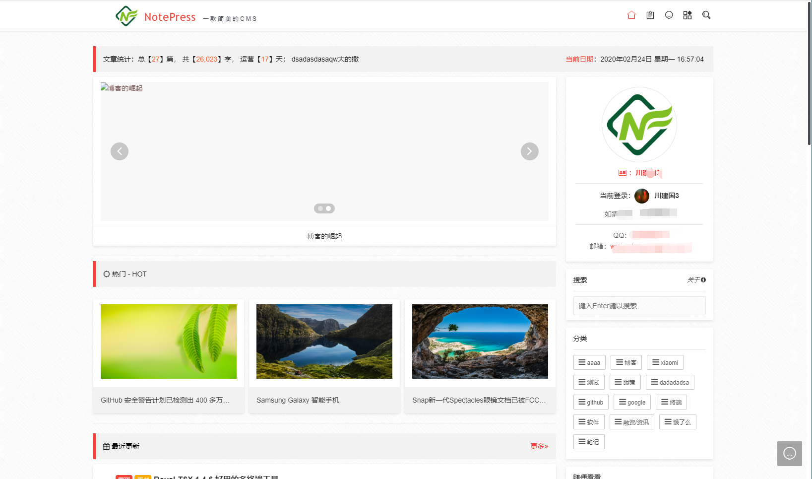
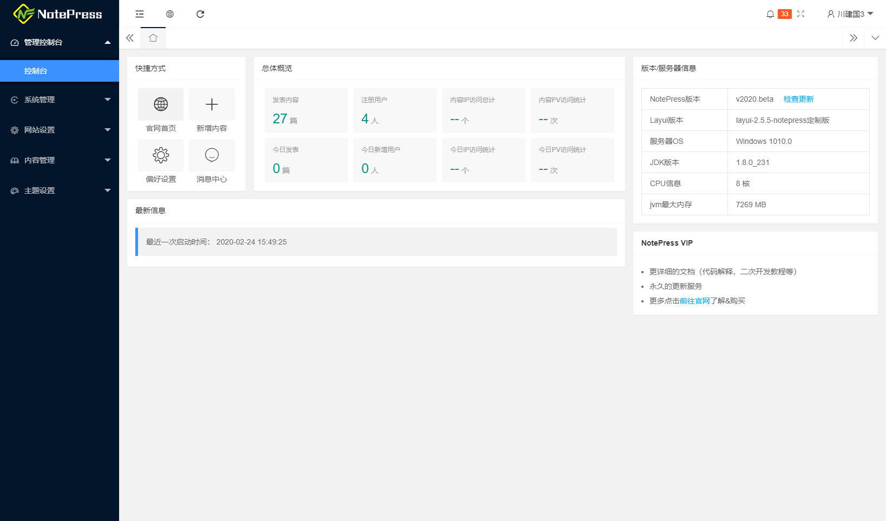
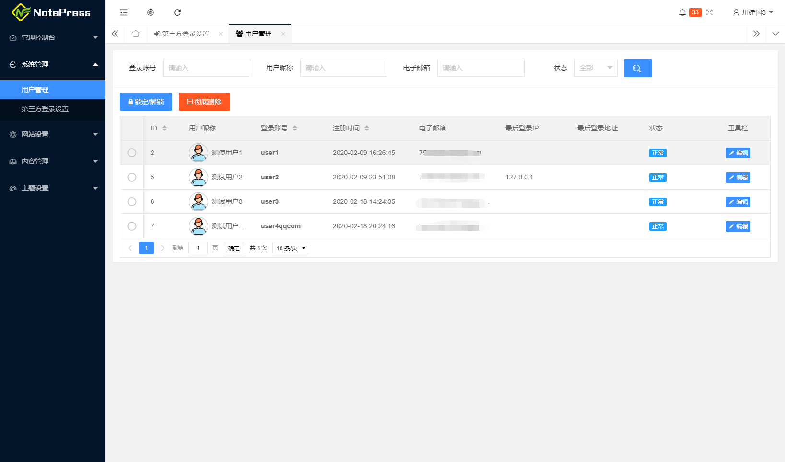
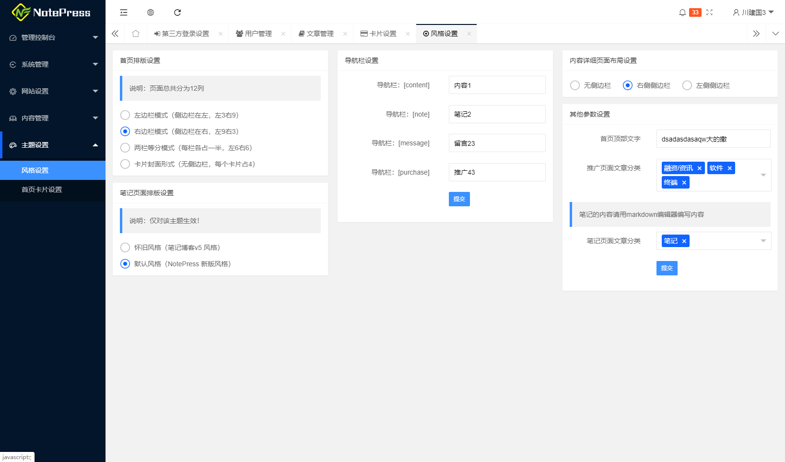
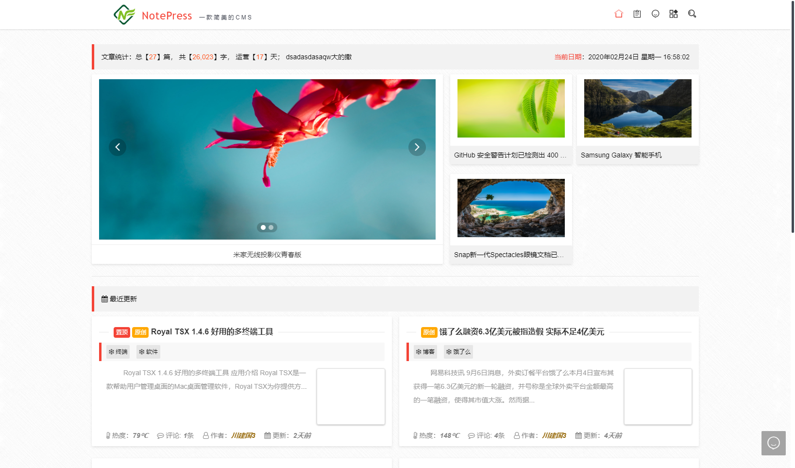

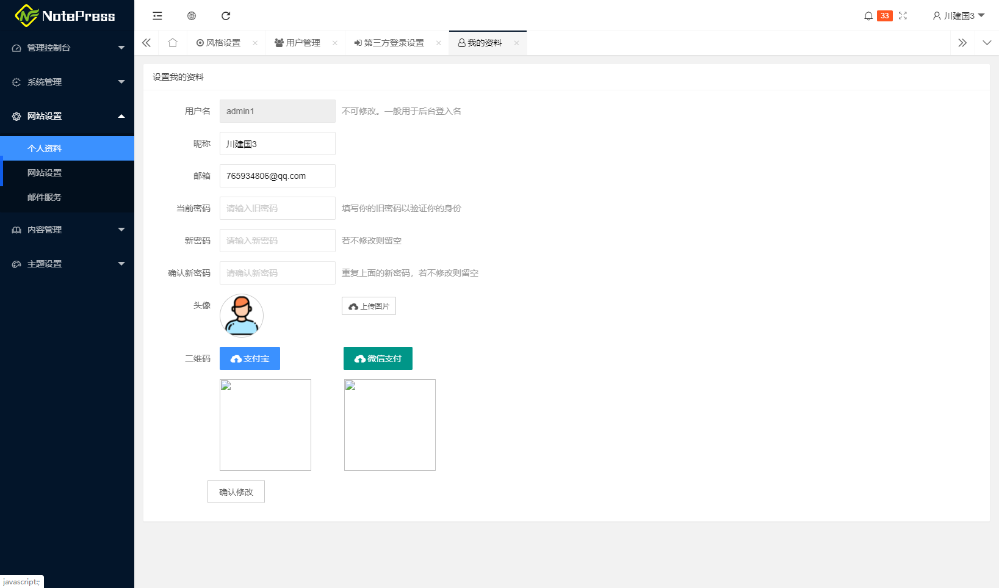
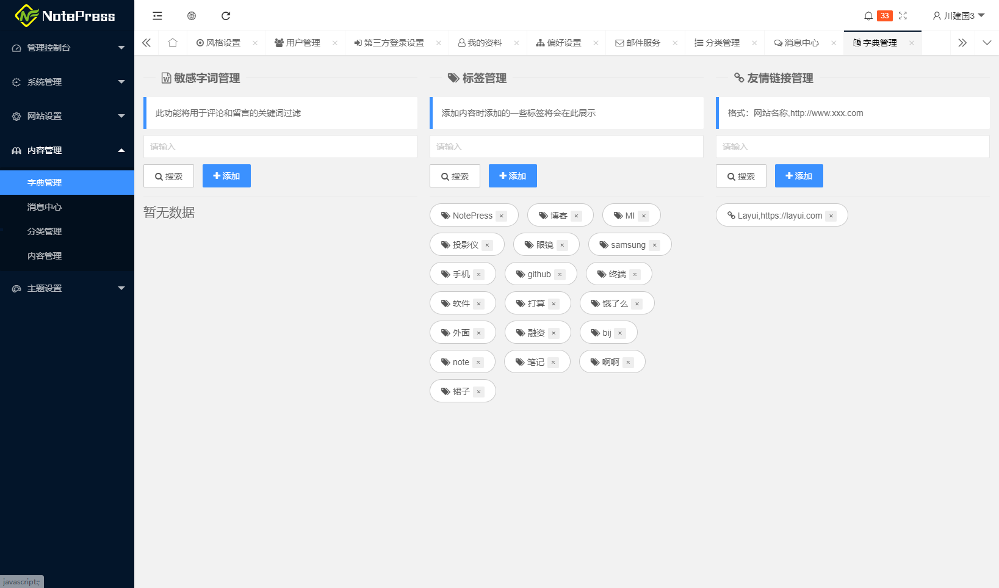
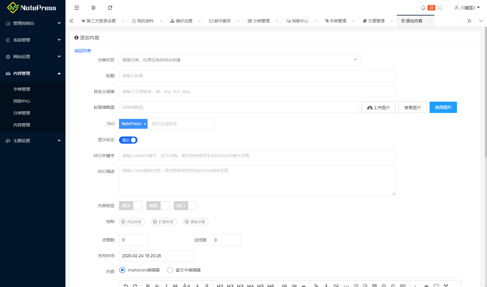
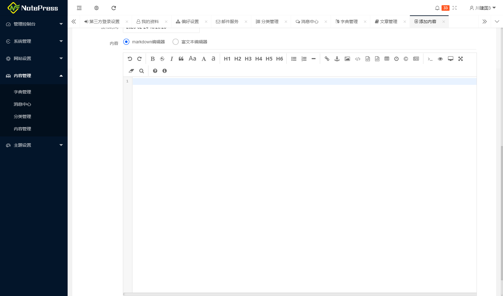


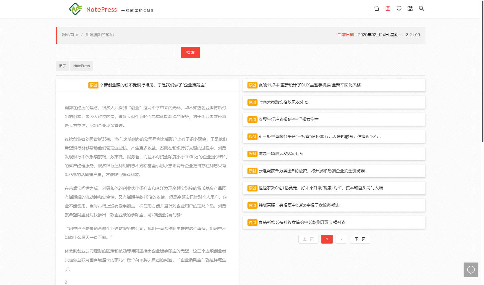
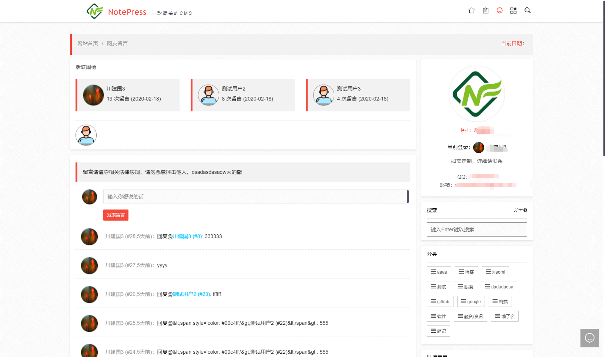
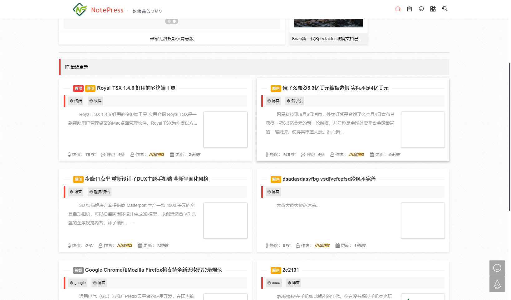
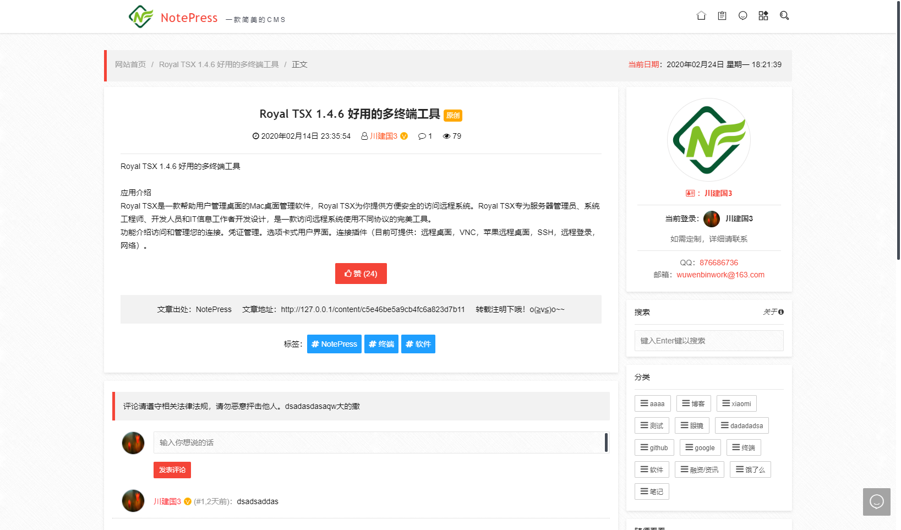


